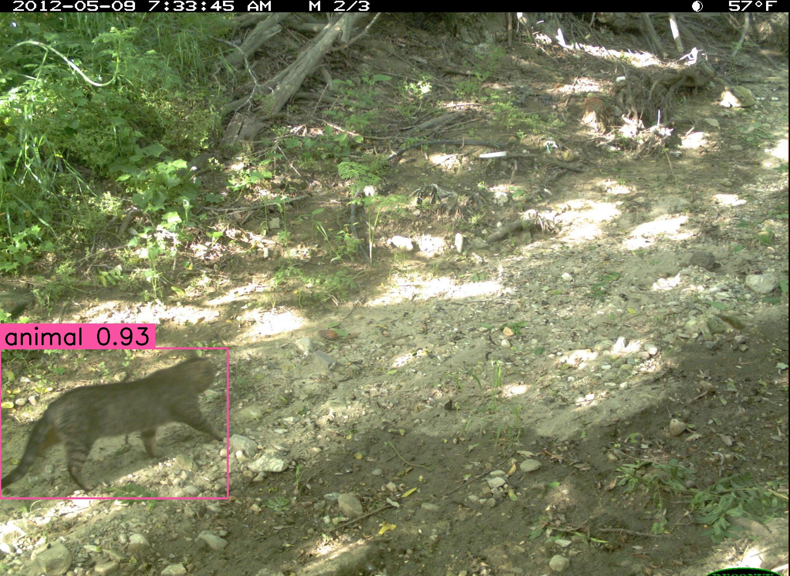
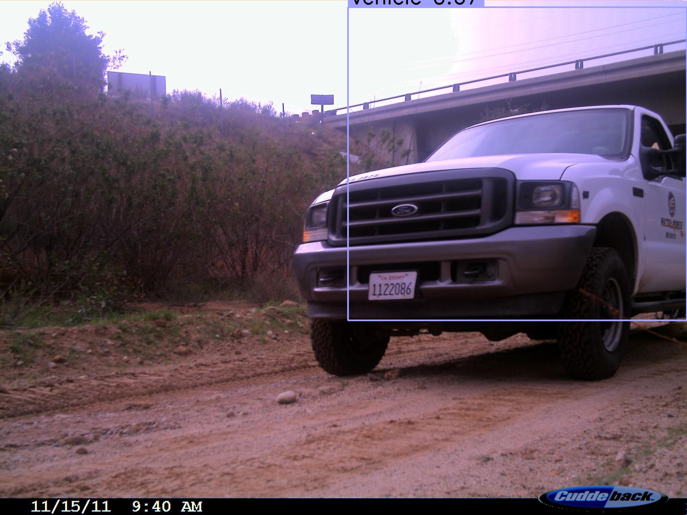
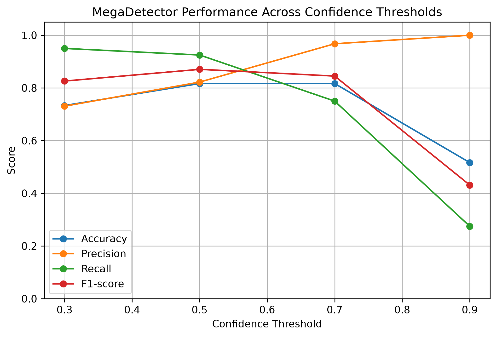

# Wildlife Camera Trap Detection using MegaDetector

A computer vision project that uses a pretrained deep learning object detector to identify **animals**, **vehicles**, and **empty frames** in wildlife camera-trap images.

The project focuses on applying a real-world deep learning model, evaluating its performance, tuning confidence thresholds, and analysing where the detector fails.

---

## Preview

### Example Detection Outputs

| Animal Detection | Vehicle Detection |
| --- | --- |
|  |  |

### Threshold Analysis



---

## Project Motivation

Camera traps are commonly used in wildlife monitoring, but they often capture large numbers of empty images due to motion triggers from wind, shadows, or vegetation.

Manually filtering these images can be time-consuming.

This project explores how a pretrained deep learning detector can help automatically identify useful camera-trap images by detecting whether an image contains:

* An animal
* A vehicle
* No relevant object

---

## What This Project Does

The pipeline:

```text
Camera-trap images
        ↓
MegaDetector object detection
        ↓
Bounding boxes + confidence scores
        ↓
Prediction summary
        ↓
Evaluation metrics
        ↓
Threshold tuning
        ↓
Error analysis
```

MegaDetector outputs:

```text
bbox: [x1, y1, x2, y2]
category: animal / person / vehicle
confidence: 0.0 - 1.0
```

---

## Why This Is Deep Learning

This project uses **MegaDetector**, a pretrained deep learning object detection model designed for camera-trap images.

The model takes image pixels as input and uses a neural network to predict:

* Where an object is located
* What broad class the object belongs to
* How confident the model is

This project does not train the detector from scratch. Instead, it focuses on the applied deep learning workflow: inference, evaluation, threshold tuning, and error analysis.

---

## Dataset

Images were sampled from the **Caltech Camera Traps** dataset.

For this experiment, I used a balanced sample of 60 images:

| Class     | Number of Images |
| --------- | ---------------: |
| Animal    |               30 |
| Empty     |               20 |
| Vehicle   |               10 |
| **Total** |           **60** |

The original labels were mapped into broader classes:

| Original Label                                          | Evaluation Class |
| ------------------------------------------------------- | ---------------- |
| cat, deer, coyote, bird, raccoon, rabbit, skunk, rodent | animal           |
| car                                                     | vehicle          |
| empty                                                   | empty            |

---

## Requirements

* Python
* PyTorch-Wildlife
* MegaDetector
* pandas
* NumPy
* OpenCV
* Matplotlib
* Pillow

---

## Project Structure

```text
wildlife-camera-trap-detector/
│
├── data/
│   ├── raw/
│   │   └── sample_images/
│   └── annotations/
│
├── scripts/
│   ├── 00_download_sample_images.py
│   ├── 01_run_detector.py
│   ├── 02_analyse_predictions.py
│   ├── 03_evaluate_detector.py
│   ├── 04_threshold_analysis.py
│   ├── 05_plot_threshold_results.py
│   ├── 06_error_analysis.py
│   └── 07_copy_error_images.py
│
├── outputs/
│   ├── predictions/
│   ├── figures/
│   ├── metrics/
│   └── error_examples/
│
├── README.md
├── requirements.txt
└── .gitignore
```

---

## How to Run

1. Install the required Python packages from `requirements.txt`.

2. Run `00_download_sample_images.py` to download a small sample of camera-trap images.

3. Run `01_run_detector.py` to apply MegaDetector to the sample images.

4. Run `02_analyse_predictions.py` to convert the model outputs into a clean prediction summary.

5. Run `03_evaluate_detector.py` to calculate evaluation metrics such as accuracy, precision, recall, and F1-score.

6. Run `04_threshold_analysis.py` and `05_plot_threshold_results.py` to compare model performance across different confidence thresholds.

7. Run `06_error_analysis.py` and `07_copy_error_images.py` to identify false positives and false negatives for further inspection.

The main outputs are saved in the `outputs/` folder:

* `outputs/predictions/` contains the raw MegaDetector prediction JSON.
* `outputs/metrics/` contains the evaluation CSV files.
* `outputs/figures/` contains visual results such as bounding-box images and the threshold analysis chart.
* `outputs/error_examples/` contains examples of incorrect predictions.

---

## Results

### Overall Performance at Threshold 0.5

| Metric        |  Score |
| ------------- | -----: |
| Accuracy      |  81.7% |
| Best F1-score | 0.8706 |

### Class-Level Results

| Class   | Precision | Recall | F1-score |
| ------- | --------: | -----: | -------: |
| Animal  |    0.7714 | 0.9000 |   0.8308 |
| Vehicle |    1.0000 | 1.0000 |   1.0000 |
| Empty   |    0.8000 | 0.6000 |   0.6857 |

### Confusion Matrix

| Actual \ Predicted | Animal | Empty | Vehicle |
| ------------------ | -----: | ----: | ------: |
| Animal             |     27 |     3 |       0 |
| Empty              |      8 |    12 |       0 |
| Vehicle            |      0 |     0 |      10 |

---

## Threshold Analysis

The detector was tested across different confidence thresholds.

| Threshold | Accuracy | Precision | Recall | F1-score |
| --------: | -------: | --------: | -----: | -------: |
|       0.3 |   0.7333 |    0.7308 | 0.9500 |   0.8261 |
|       0.5 |   0.8167 |    0.8222 | 0.9250 |   0.8706 |
|       0.7 |   0.8167 |    0.9677 | 0.7500 |   0.8451 |
|       0.9 |   0.5167 |    1.0000 | 0.2750 |   0.4314 |

A threshold of **0.5** was selected because it achieved the highest F1-score and provided the best balance between precision and recall.

Lower thresholds detected more animals but created more false positives. Higher thresholds reduced false positives but missed more animals.

---

## Error Analysis

At threshold 0.5, the model made 11 errors:

| Error Type      | Count |
| --------------- | ----: |
| False Positives |     8 |
| False Negatives |     3 |

### False Positives

The model sometimes detected animals in empty images.

Possible causes:

* Branches or vegetation resembling animal shapes
* Shadows
* Motion blur
* Camera artefacts
* Poor lighting

### False Negatives

The model missed some real animal images.

Possible causes:

* Small animals
* Partial animals
* Animals near the edge of the frame
* Low contrast
* Night-time images
* Occlusion by vegetation

---

## Key Insights

* MegaDetector performed well on animal and vehicle detection.
* Empty-frame detection was more challenging.
* Threshold tuning had a major impact on model behaviour.
* A threshold of 0.5 gave the best balance between catching animals and avoiding false positives.
* Error analysis showed that background noise and difficult image conditions can affect detector reliability.

---

## Limitations

* The current experiment uses a small 60-image sample.
* The model only predicts broad classes, not exact animal species.
* Species such as deer, coyote, raccoon, and bird are all grouped as `animal`.
* Evaluation currently uses image-level labels, not full bounding-box IoU against ground truth.
* Results may change with a larger and more diverse sample.

---

## Future Improvements

* Increase the dataset size to several hundred or thousand images.
* Evaluate bounding box quality using IoU.
* Train a second-stage species classifier on cropped animal detections.
* Compare MegaDetector with YOLO or Faster R-CNN.
* Build a Streamlit app for image upload and automatic detection.
* Add more visual examples of false positives and false negatives.

---

## Conclusion

This project demonstrates an applied deep learning workflow for wildlife camera-trap image analysis.

Using MegaDetector, I built a pipeline that can detect animals, vehicles, and empty frames, evaluate performance, tune confidence thresholds, and analyse failure cases.

The project shows how pretrained deep learning models can be used in practical conservation workflows where large volumes of camera-trap images need to be filtered efficiently.
# Wildlife-Camera-Trap-Detector

